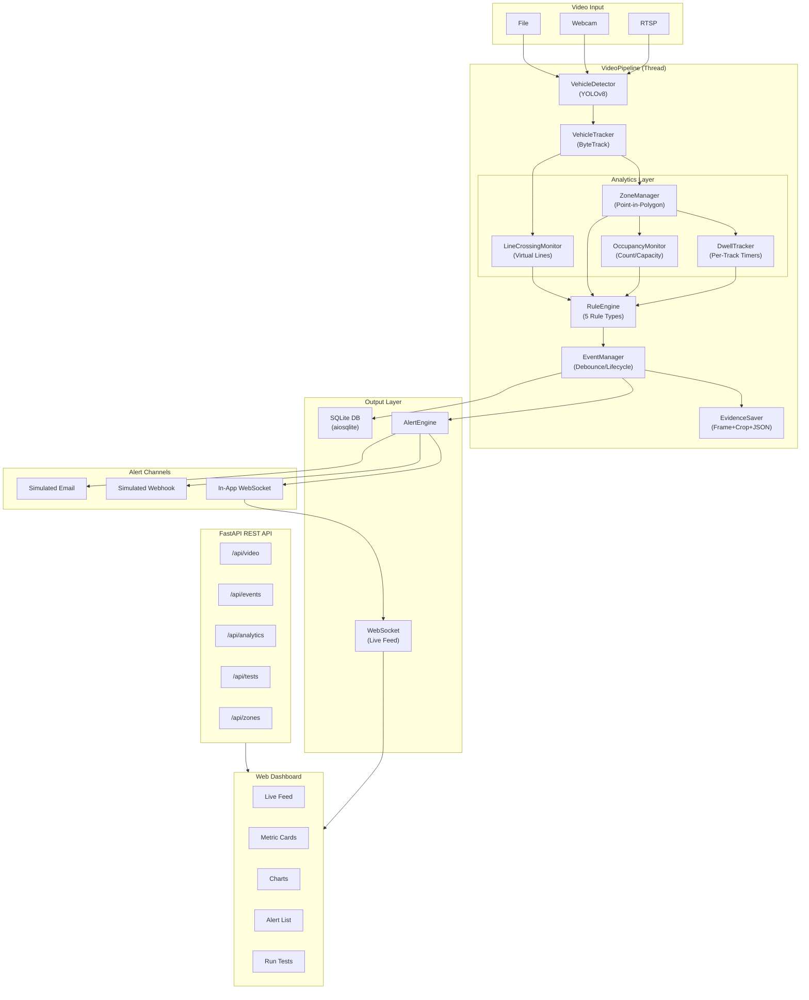
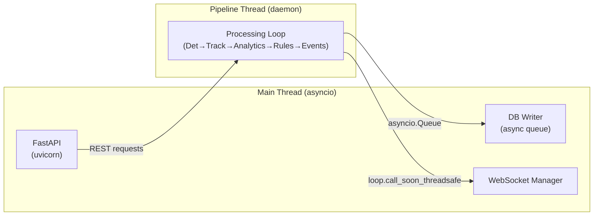

# System Architecture

## Overview

The **Intelligent Vehicle Event Detection & Alerting Platform** is a real-time computer vision system that detects, tracks, and monitors vehicles in video streams. It fires configurable events when vehicles violate rules (intrusion, loitering, wrong direction, overcrowding, parking violations) and delivers alerts through multiple channels.

---

## Architecture Diagram

---

## Component Details

### Video Input Layer (`app/vision/video_source.py`)

Three source implementations sharing a common `VideoSource` interface:

| Source | Class | Key Feature |
|---|---|---|
| File | `FileVideoSource` | Reads from local video files; validates extension and readability |
| Webcam | `WebcamVideoSource` | Opens USB/built-in camera by device index |
| RTSP | `RTSPVideoSource` | Connects to RTSP URL with exponential backoff reconnection |

All sources produce frames as numpy arrays (BGR, OpenCV format).

### Detection (`app/vision/detector.py`)

- **Model**: YOLOv8 (configurable variant via `model.path` in config.yaml)
- **Class**: `VehicleDetector`
- **Outputs**: Bounding boxes, class IDs, confidence scores
- **Architecture constraint**: No event logic here — detection only produces raw detections

### Tracking (`app/vision/tracker.py`)

- **Algorithm**: ByteTrack via `supervision` library
- **Class**: `VehicleTracker` → produces `TrackedVehicle` instances
- **Per-track state**: track_id, class_name, bbox, centroid, confidence, position_history, first_seen, last_seen, trail, is_stationary()

### Analytics Layer (`app/analytics/`)

| Module | Class | Purpose |
|---|---|---|
| `zones.py` | `ZoneManager` | Point-in-polygon containment; emits ENTRY/EXIT events on state transitions |
| `lines.py` | `LineCrossingMonitor` | Virtual line crossing with signed-distance test; A→B/B→A; hysteresis cooldown |
| `dwell.py` | `DwellTracker` | Per-(track_id, zone_id) dwell timers with grace period for brief tracking loss |
| `occupancy.py` | `OccupancyMonitor` | Real-time count per zone; max_capacity threshold; time-series storage |
| `performance.py` | `PerformanceMonitor` | Per-stage timing (detection, tracking, analytics, rules); CPU/memory via psutil |

### Rule Engine (`app/rules/`)

All rules extend `BaseRule` and implement `evaluate(context: RuleContext) → List[RuleViolation]`.

| Rule | Class | Event Type | Trigger |
|---|---|---|---|
| Intrusion | `IntrusionRule` | ZONE_INTRUSION | Vehicle enters restricted zone |
| Loitering | `LoiteringRule` | LOITERING | Dwell exceeds threshold in zone |
| Parking Violation | `ParkingViolationRule` | PARKING_VIOLATION | Stationary + dwell > grace period in restricted zone |
| Occupancy | `OccupancyRule` | OVER_CAPACITY | Zone count exceeds max_capacity |
| Wrong Direction | `WrongDirectionRule` | WRONG_DIRECTION | Line crossing in unexpected direction |

Rules receive a `RuleContext` containing all tracked vehicles, zone occupancies, dwell state, line crossing events, and occupancy data.

### Event Management (`app/events/`)

| Module | Class | Purpose |
|---|---|---|
| `event_manager.py` | `EventManager` | Debouncing (key = rule:track:zone), lifecycle (DETECTED→ACTIVE→ACK→RESOLVED), auto-resolve, max capacity |
| `evidence.py` | `EvidenceSaver` | Saves full frame JPEG, cropped vehicle JPEG, metadata JSON per event |
| `alerts.py` | `AlertEngine` | Routes events to pluggable channels (WebSocket, webhook, email) |

### Database (`app/database/`)

- **Engine**: SQLite via aiosqlite + SQLAlchemy async
- **Tables**: `events`, `occupancy_records`, `zone_configs`, `rule_configs`
- **Fallback**: In-memory SQLite if file DB initialization fails

### API Layer (`app/api/`)

| Router | Prefix | Purpose |
|---|---|---|
| `video.py` | `/api/video` | Upload, webcam start, RTSP connect, stop, status |
| `events.py` | `/api/events` | List, filter, paginate, acknowledge, resolve, CSV export |
| `analytics.py` | `/api/analytics` | Live metrics, summary, occupancy, dwell stats, performance |
| `test_runner.py` | `/api/tests` | Run tests + experiments, download CSV results |
| `websocket.py` | `/ws/live` | WebSocket for live frame + metrics streaming |

### Dashboard (`static/`)

Single-page app with live WebSocket streaming, metric cards, Chart.js visualizations, alert feed, zone editor, and integrated test runner.

---

## Concurrency Model

- **Pipeline runs in a daemon thread** with its own processing loop
- **Communication to asyncio**: Thread-safe callbacks via `loop.call_soon_threadsafe` and `asyncio.Queue`
- **Database writes**: Async queue consumed by `_db_writer` coroutine in the event loop
- **WebSocket broadcasts**: Scheduled from pipeline thread into the asyncio loop

---

## Data Flow (Per Frame)

1. **Frame Read** → VideoSource produces numpy BGR frame
2. **Detection** → YOLOv8 produces bounding boxes + classes
3. **Tracking** → ByteTrack assigns persistent IDs → `TrackedVehicle` list
4. **Zone Analysis** → `ZoneManager.update()` → ENTRY/EXIT events
5. **Line Analysis** → `LineCrossingMonitor.update()` → crossing events
6. **Dwell Update** → `DwellTracker.update_all()` → per-track timers
7. **Occupancy Update** → `OccupancyMonitor.update()` → counts
8. **Rule Evaluation** → All enabled rules evaluate `RuleContext` → `RuleViolation` list
9. **Event Processing** → `EventManager.process_violations()` → debounced `Event` objects
10. **Evidence** → `EvidenceSaver.save()` → frame/crop/JSON on new events
11. **Alerts** → `AlertEngine.send_alert()` → WebSocket/webhook/email
12. **Database** → Event pushed to async queue → persisted to SQLite
13. **Dashboard** → Annotated frame + metrics broadcast via WebSocket

---

## Key Design Decisions

See [architecture_decisions.md](architecture_decisions.md) for detailed rationale on:
1. ByteTrack tracker choice
2. Event debouncing strategy
3. Loitering detection limitations
4. False positive analysis
5. Virtual line crossing hysteresis
6. Performance bottleneck analysis
7. Evidence storage at high event rates
8. RTSP support notes
