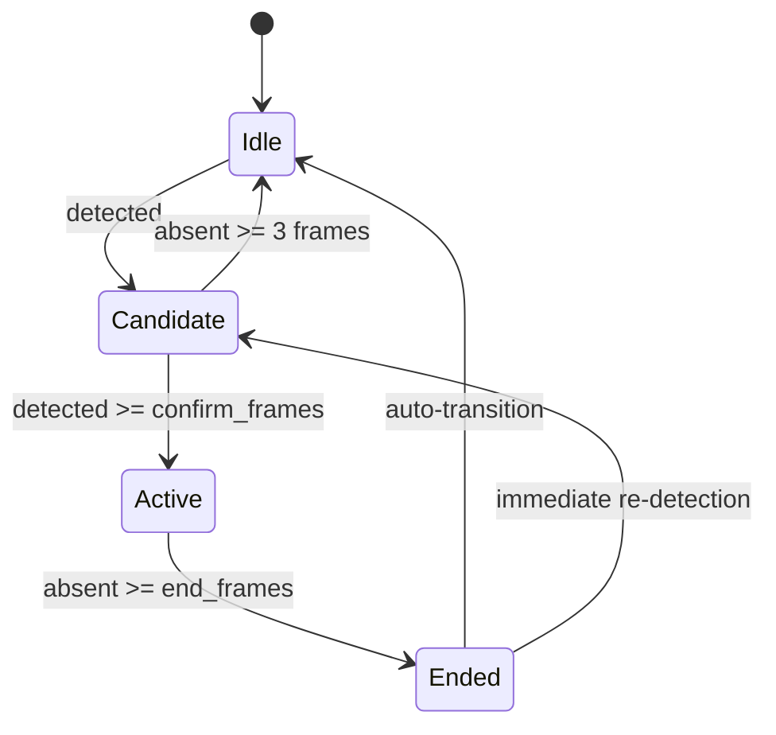
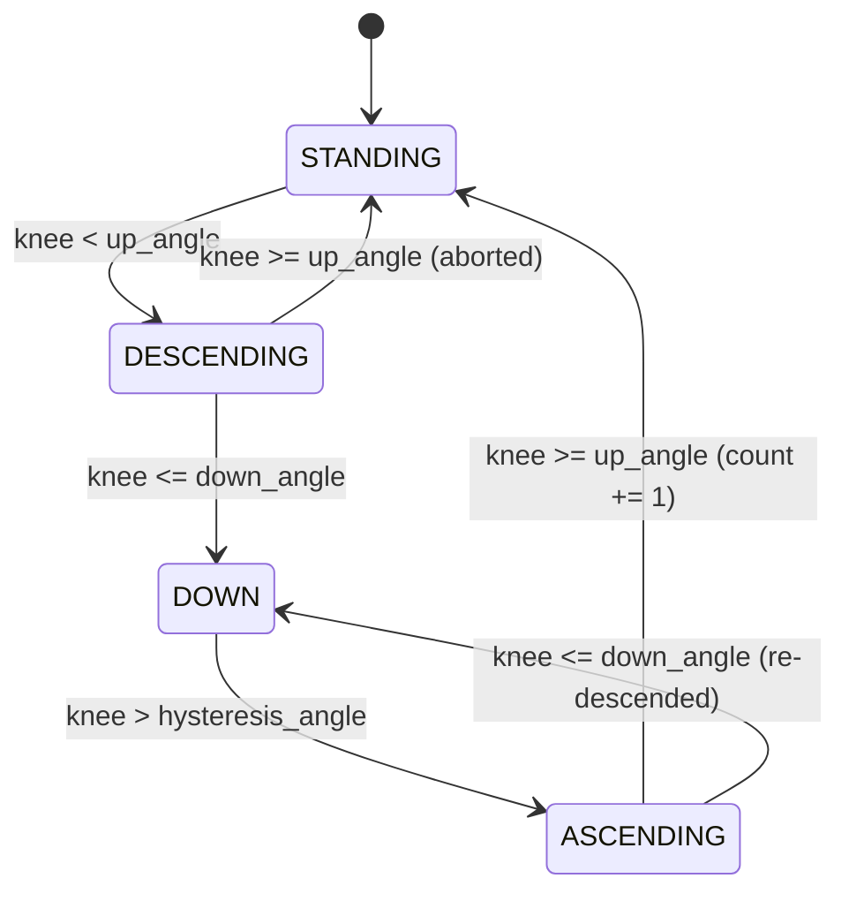

# Sentinel Pose Intel — Activity Rules & Thresholds

## Activity State Machine (§4.9)

All activities pass through a temporal smoothing state machine before being confirmed.
This prevents per-frame label flipping from noisy detections.



| Parameter | Default | Description |
|-----------|---------|-------------|
| `activity_confirm_frames` | 5 | Frames activity must persist to move Candidate -> Active |
| `activity_end_frames` | 8 | Frames activity must be absent to move Active -> Ended |
| `fall_confirm_frames` | 15 | Fall uses a longer confirmation window to reduce false positives |

**Hysteresis**: In Candidate state, up to 2 consecutive absent frames are tolerated without resetting (brief detection drops from keypoint jitter).

---

## Activity Recognisers

### Standing (§4.8)

**Module**: `app/activities/standing.py`

| Rule | Threshold | Config Key |
|------|-----------|-----------|
| Torso angle < max | 15 deg | `standing_max_torso_angle` |
| Hip velocity < max | 0.008 (normalised) | `standing_max_velocity` |
| Knee angle > 150 deg | 150 deg (hardcoded) | — |

**Detection**: All visible checks must pass. If knees are not visible, that check is skipped (not penalised).

**Priority**: 10 (lowest — overridden by walking, sitting, etc.)

---

### Sitting (§4.8)

**Module**: `app/activities/sitting.py`

| Rule | Threshold | Config Key |
|------|-----------|-----------|
| Knee angle < max | 120 deg | `sitting_max_knee_angle` |
| Torso angle < 30 deg | 30 deg (hardcoded) | — |
| Hip velocity < max | 0.008 (normalised) | `standing_max_velocity` |

**Detection**: Knee angle is the primary condition and must be present and pass. All visible checks must also pass.

**Priority**: 15

**Known limitation**: A person crouching with an upright torso may trigger sitting. Crouching is handled by the ergonomic monitor, not as a separate activity.

---

### Walking (§4.8)

**Module**: `app/activities/walking.py`

| Rule | Threshold | Config Key |
|------|-----------|-----------|
| Hip velocity > threshold | 0.015 (normalised) | `walking_velocity_threshold` |
| Torso angle < 25 deg | 25 deg (hardcoded) | — |
| Knee angle variation (bonus) | — | — |

**Detection**: Velocity is the primary condition (weight: 1.5x). Torso uprightness is secondary. Knee angle variation provides a bonus for gait signature but isn't required.

**Priority**: 20

**Known limitation**: Cannot distinguish walking from very slow walking near the threshold. Walking has priority over standing when both fire.

---

### Hand Raised (§4.8)

**Module**: `app/activities/hand_raise.py`

| Rule | Threshold | Config Key |
|------|-----------|-----------|
| Wrist.y < Shoulder.y | — (geometric) | — |
| Elbow angle >= min | 120 deg | `hand_raise_min_elbow_angle` |

**Detection**: At least one wrist must be above its corresponding shoulder. Extended arm (elbow angle >= 120 deg) gives higher confidence. Both arms raised = 0.95 confidence; one arm = 0.85.

**Priority**: 35

---

### Bending (Bonus #1)

**Module**: `app/activities/bending.py`

| Rule | Threshold | Config Key |
|------|-----------|-----------|
| Torso angle > min | 45 deg | `bending_min_torso_angle` |
| Hip velocity < fall threshold | 0.05 (normalised) | `fall_speed_threshold` |
| Knee angle > 140 deg | 140 deg (hardcoded) | — |

**Detection**: Torso angle is the primary condition. Velocity check distinguishes bending from falling. Straight legs distinguish from sitting/crouching.

**Priority**: 30

**Known limitation**: A person bending with very bent knees may look like crouching.

---

### Waving (Bonus #2)

**Module**: `app/activities/waving.py`

| Rule | Threshold | Config Key |
|------|-----------|-----------|
| Wrist above shoulder | — (geometric) | — |
| Lateral oscillations >= min | 2 direction changes | `waving_min_oscillations` |

**Detection**: First checks for a raised hand, then looks for lateral wrist oscillation in the buffer (last 20 frames). Confidence scales with oscillation count: `0.7 + 0.1 * oscillations`.

**Priority**: 40

**Known limitation**: Very slow or very small waves may not produce enough oscillation. A sustained hand-raise won't trigger waving (only Hand Raised).

---

### Fall Detection (§4.10, §4.11)

**Module**: `app/activities/fall.py`

Multi-factor analysis scoring 5 independent indicators:

| Factor | Description | Threshold | Config Key |
|--------|-------------|-----------|-----------|
| F1: Torso orientation | Torso angle from vertical | > 60 deg | `fall_torso_angle_threshold` |
| F2: Rapid descent | Max hip velocity in buffer | > 0.05 (normalised) | `fall_speed_threshold` |
| F3: Aspect ratio | Bbox width/height | > 1.0 (wider than tall) | — |
| F4: Head near hip | Head Y approaches hip Y | < 10 px difference | — |
| F5: Post-fall stillness | Low velocity after rapid motion | < standing_max_velocity | — |

**Detection**: `factors_met >= fall_min_factors` (default 3 of 5).

**Priority**: 100 (highest — always overrides all other activities).

**Confidence**: `factors_met / 5` (e.g., 3/5 = 0.6, 5/5 = 1.0).

**Distinguishes from**:
- **Sitting**: slower descent + knee flexion + torso stays more upright
- **Bending**: torso tilts but hip Y doesn't drop rapidly; returns upright
- **Lying normally**: no rapid descent (already on ground when first seen)

**Alert lifecycle** (§4.11):
```
Possible Fall -> Fall Confirmed (15 frames) -> Alert Active -> Acknowledged -> Resolved
```

No repeated alerts for the same person within `fall_alert_cooldown_seconds` (default 30s).

---

### Squat Counting (§4.12)

**Module**: `app/activities/squats.py`

4-phase state machine tracking knee angle through a squat cycle:



| Parameter | Default | Config Key |
|-----------|---------|-----------|
| Up angle | 160 deg | `squat_up_knee_angle` |
| Down angle | 90 deg | `squat_down_knee_angle` |
| Hysteresis angle | 110 deg | `squat_hysteresis_angle` |

**Hysteresis**: The `hysteresis_angle` (110 deg) is between `down_angle` (90 deg) and `up_angle` (160 deg). This prevents jittery knee readings near the bottom from toggling the counter. The person must rise at least 20 deg past the down threshold before the ascending phase begins.

---

## Ergonomic Monitoring (§4.13)

**Module**: `app/activities/ergonomic.py`

Tracks two posture-risk scenarios with duration timers:

| Risk | Trigger Condition | Warning Threshold | Config Keys |
|------|-------------------|-------------------|-------------|
| Prolonged bending | Torso angle > 45 deg | 15 seconds continuous | `bending_min_torso_angle`, `ergo_bend_warn_seconds` |
| Prolonged crouching | Both knee angles < 100 deg | 15 seconds continuous | `ergo_crouch_max_knee_angle`, `ergo_crouch_warn_seconds` |

**Reset**: Timers reset when the person returns to a safe posture. The `bend_warned` / `crouch_warned` flags clear on reset, allowing re-triggering if the person bends again.

> **Disclaimer**: This is a prototype posture monitoring tool. It is NOT a certified ergonomic assessment and must NOT be used as medical or occupational health advice.

---

## Alert System (§4.17)

| Alert Type | Severity | Trigger |
|------------|----------|---------|
| `fall_detected` | CRITICAL | Fall state machine active |
| `posture_risk_bending` | WARNING | Ergonomic bend risk flag |
| `posture_risk_crouching` | WARNING | Ergonomic crouch risk flag |
| `long_inactivity` | INFO | Standing/Unknown for > 300s |

**Cooldown**: No repeated alerts for the same `(person_id, alert_type)` within `alert_cooldown_seconds` (default 60s). Fall alerts use `fall_alert_cooldown_seconds` (default 30s).

---

## Activity Priority Table

When multiple activities fire simultaneously, the highest-priority one wins:

| Activity | Priority |
|----------|----------|
| `fall` | 100 |
| `squats` | 50 |
| `waving` | 40 |
| `hand_raised` | 35 |
| `bending` | 30 |
| `walking` | 20 |
| `sitting` | 15 |
| `standing` | 10 |

---

## Complete Configuration Reference

| Key | Default | Type | Description |
|-----|---------|------|-------------|
| `video_source` | `"0"` | str | Video file path, webcam index, or RTSP URL |
| `pose_model` | `"yolov8n-pose.pt"` | str | YOLO model name or path |
| `detection_confidence_threshold` | 0.5 | float | Detection confidence cutoff |
| `keypoint_confidence_threshold` | 0.3 | float | Keypoint confidence cutoff |
| `min_visible_keypoints` | 8 | int | Min keypoints to accept a pose |
| `tracker_type` | `"bytetrack"` | str | Tracker backend |
| `track_loss_timeout_frames` | 30 | int | Frames before marking a track lost |
| `sequence_buffer_length` | 30 | int | Rolling buffer size per person |
| `activity_confirm_frames` | 5 | int | Frames to confirm an activity |
| `activity_end_frames` | 8 | int | Frames to end an activity |
| `standing_max_velocity` | 0.008 | float | Max velocity for standing |
| `standing_max_torso_angle` | 15.0 | float | Max torso angle for standing (deg) |
| `walking_velocity_threshold` | 0.015 | float | Min velocity for walking |
| `sitting_max_knee_angle` | 120.0 | float | Max knee angle for sitting (deg) |
| `hand_raise_min_elbow_angle` | 120.0 | float | Min elbow angle for hand raise (deg) |
| `bending_min_torso_angle` | 45.0 | float | Min torso angle for bending (deg) |
| `waving_min_oscillations` | 2 | int | Min wrist direction changes for waving |
| `fall_torso_angle_threshold` | 60.0 | float | Torso angle for fall factor (deg) |
| `fall_speed_threshold` | 0.05 | float | Hip velocity for fall factor |
| `fall_confirm_frames` | 15 | int | Frames to confirm fall |
| `fall_alert_cooldown_seconds` | 30.0 | float | Fall alert cooldown (s) |
| `fall_min_factors` | 3 | int | Min factors (of 5) to trigger fall |
| `squat_down_knee_angle` | 90.0 | float | Knee angle for squat bottom (deg) |
| `squat_up_knee_angle` | 160.0 | float | Knee angle for squat top (deg) |
| `squat_hysteresis_angle` | 110.0 | float | Knee angle for squat hysteresis (deg) |
| `ergo_bend_warn_seconds` | 15.0 | float | Bending warning threshold (s) |
| `ergo_crouch_warn_seconds` | 15.0 | float | Crouching warning threshold (s) |
| `ergo_crouch_max_knee_angle` | 100.0 | float | Max knee angle for crouching (deg) |
| `alert_cooldown_seconds` | 60.0 | float | General alert cooldown (s) |
| `inactivity_warn_seconds` | 300.0 | float | Inactivity warning threshold (s) |
| `database_path` | `"data/sentinel_pose.db"` | str | SQLite database path |
| `evidence_dir` | `"evidence"` | str | Evidence image directory |
| `log_level` | `"INFO"` | str | Logging level |
| `log_file` | `"logs/sentinel_pose.log"` | str | Log file path |
