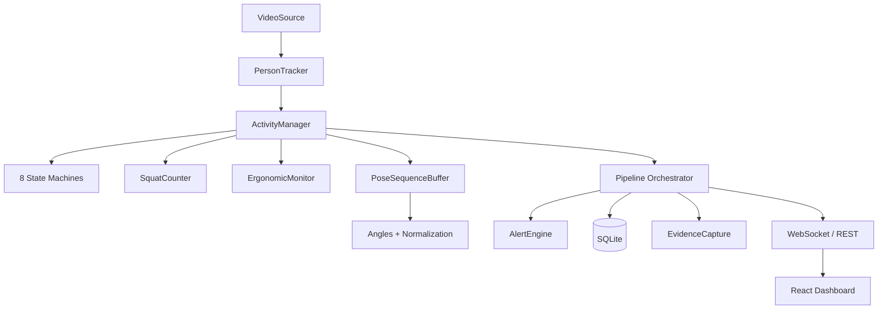

# Full Project Review — Sentinel Pose Intel

> Reviewed: all 24 Python backend modules, 1 frontend API client, frontend types, and project config.

---

## Architecture Summary



The architecture is clean and well-layered. Each module has a single responsibility and clear interfaces.

---

## Bugs Found

### BUG-1: `pipeline.py:196` — Frame number drift (LOW)
```python
frame_num = self._tracker.frame_number + 1  # ← pre-increments
persons = self._tracker.update(frame)        # ← tracker also increments internally
```
After `update()`, `self._tracker.frame_number` already equals `frame_num`. This works but is fragile — if tracker logic changes, counts could drift.

**Fix**: Use `self._tracker.frame_number` *after* `update()` instead.

---

### BUG-2: `pipeline.py:368` — Unicode em-dash in error string (MEDIUM)
```python
self._status.error = "Pipeline crashed — check logs"
```
This will cause a `UnicodeEncodeError` on Windows cp1252 if logged to console — same bug we fixed elsewhere.

---

### BUG-3: `person_tracker.py:193-203` — Dict mutation during iteration (MEDIUM)
```python
lost_ids = []
for tid, tp in self._persons.items():
    if tp.frames_since_seen > self._track_loss_timeout:
        tp.is_active = False
        lost_ids.append(tid)
# Then deletes from self._persons using lost_ids
for tid in lost_ids:
    if self._persons[tid].frames_since_seen > self._track_loss_timeout * 2:
        del self._persons[tid]
```
The second loop deletes items that may have just been added to `lost_ids` on the *same* frame. If a person becomes lost at exactly `timeout+1` frames, `lost_ids` includes them, but the delete condition `> timeout * 2` is not met yet. This is safe but the logic conflates "deactivate" and "cleanup" in one pass — a person hitting exactly `2*timeout` frames_since_seen will be cleaned up correctly. **No runtime bug, but confusing.**

---

### BUG-4: `normalization.py:90-110` — Dead code (LOW)
```python
def compute_velocity(norm_prev, norm_curr) -> Optional[float]:
    ...
    return None  # Not used directly — see below.
```
The function `compute_velocity` always returns `None` and is never called. Dead code.

---

### BUG-5: `main.py:64-67` — Static mount order issue (MEDIUM)
```python
app.mount("/evidence", StaticFiles(...))  # Mounted AFTER catch-all "/"
```
When the `dist/` build exists, the `"/"` mount is a catch-all (`html=True`). The `/evidence` mount registered after it will be shadowed. It must be registered **before** the catch-all `/` mount.

---

## Design Issues

### DESIGN-1: `routes.py` accesses `_pipeline._db` directly (MEDIUM)
```python
if _pipeline._db is None:
    return []
return _pipeline._db.query_activity_events(...)
```
Accessing private `_db` from outside the class violates encapsulation. The Pipeline class should expose a public accessor or the routes should use a shared DB instance.

---

### DESIGN-2: Duplicate YOLO model loading (HIGH)
`PersonTracker.__init__` and `YoloPoseEstimator.__init__` each load `YOLO(model_path)`. Since the pipeline uses `PersonTracker` (which includes pose data via `.track()`), the separate `YoloPoseEstimator` is created in the demo script but **not** used in the pipeline. However, if someone instantiates both, they'll load the 6.5 MB model twice into memory.

**Recommendation**: The pipeline correctly uses only `PersonTracker`. Remove `YoloPoseEstimator` from the import chain in `pipeline.py` (it's only imported for `draw_skeletons`, which should be in its own module or `keypoints.py`).

---

### DESIGN-3: WebSocket sends full base64 frames (LOW)
Encoding a 640x480 frame at JPEG Q60 produces ~30 KB per frame × 10 FPS = ~300 KB/s. This is fine for a single client on localhost but will bottleneck with multiple clients or over a network. Acceptable for prototype.

---

### DESIGN-4: `activity_manager.py:224` — Unicode arrow in log (LOW)
```python
logger.info("Person #%03d: activity → %s ...")
```
Will fail on Windows cp1252 console.

---

## Missing Items

### MISSING-1: `__init__.py` files in subpackages
The following directories need `__init__.py` files (some may already exist from Phase 1):
- `app/activities/`
- `app/database/`  
- `app/events/`
- `app/dashboard/`

Let me verify this is actually blocking — if imports work, they exist.

### MISSING-2: Frontend not wired to backend WebSocket
The React dashboard at `localhost:3000` is running with **mock data** (`src/data/`). The `src/api/client.ts` exists but `App.tsx` does not import or use it yet. The dashboard won't show live pipeline data until wired.

### MISSING-3: Phases 10-14 not built
- Evaluation harness
- Error handling pass
- Documentation (architecture.md, activity_rules.md, etc.)
- Unit tests
- Final cleanup / traceability

---

## Code Quality Assessment

| Area | Grade | Notes |
|---|---|---|
| **Module structure** | A | Clean separation, one responsibility per file |
| **Docstrings** | A | Every module, class, and public method documented |
| **Type hints** | A | Consistent use of `Optional`, `List`, `Dict`, return types |
| **Error handling** | B+ | Graceful None returns, try/except in evidence capture. Some bare `except Exception` without logging |
| **Config management** | A | All thresholds configurable, JSON sidecar for hot-reload |
| **Spec compliance** | A- | Covers §4.1-§4.17. Missing §4.18-§4.21 (docs, tests, eval) |
| **Activity rules** | A | Well-documented thresholds, rule explanations in candidates |
| **Fall detection** | A | Multi-factor with 5 indicators, configurable minimum |
| **State machine** | A | Clean state diagram, hysteresis, persistence thresholds |
| **Database** | A | WAL mode, indexes, parameterized queries, CSV export |
| **Encoding compat** | B- | Several Unicode characters will break on Windows cp1252 |

---

## Recommended Fix Priority

| # | Fix | Severity | Effort |
|---|---|---|---|
| 1 | BUG-5: Reorder `/evidence` mount before `/` catch-all | MEDIUM | 2 min |
| 2 | BUG-2 + DESIGN-4: Replace remaining Unicode in log strings | MEDIUM | 5 min |
| 3 | DESIGN-1: Add public DB accessor to Pipeline | MEDIUM | 5 min |
| 4 | BUG-4: Remove dead `compute_velocity` function | LOW | 1 min |
| 5 | BUG-1: Use tracker's frame_number after update() | LOW | 1 min |
| 6 | MISSING-2: Wire App.tsx to WebSocket + API | HIGH | 30 min |

> [!IMPORTANT]
> **Critical next step**: Wire the React frontend to the live backend (MISSING-2). The entire pipeline works but the dashboard still shows mock data.

---

## Files Reviewed (24 backend + 2 frontend)

| File | Lines | Status |
|---|---|---|
| [__init__.py](file:///c:/Users/ranat/Downloads/sentinel-pose-intel/app/__init__.py) | 63 | OK |
| [config.py](file:///c:/Users/ranat/Downloads/sentinel-pose-intel/app/config.py) | 234 | OK |
| [main.py](file:///c:/Users/ranat/Downloads/sentinel-pose-intel/app/main.py) | 70 | BUG-5 |
| [pipeline.py](file:///c:/Users/ranat/Downloads/sentinel-pose-intel/app/pipeline.py) | 394 | BUG-1, BUG-2 |
| [video_source.py](file:///c:/Users/ranat/Downloads/sentinel-pose-intel/app/vision/video_source.py) | 181 | OK |
| [pose_estimator.py](file:///c:/Users/ranat/Downloads/sentinel-pose-intel/app/vision/pose_estimator.py) | 238 | OK |
| [person_tracker.py](file:///c:/Users/ranat/Downloads/sentinel-pose-intel/app/vision/person_tracker.py) | 228 | BUG-3 (safe) |
| [keypoints.py](file:///c:/Users/ranat/Downloads/sentinel-pose-intel/app/pose/keypoints.py) | 218 | OK |
| [angles.py](file:///c:/Users/ranat/Downloads/sentinel-pose-intel/app/pose/angles.py) | 185 | OK |
| [normalization.py](file:///c:/Users/ranat/Downloads/sentinel-pose-intel/app/pose/normalization.py) | 137 | BUG-4 |
| [sequence.py](file:///c:/Users/ranat/Downloads/sentinel-pose-intel/app/pose/sequence.py) | 275 | OK |
| [base_activity.py](file:///c:/Users/ranat/Downloads/sentinel-pose-intel/app/activities/base_activity.py) | 80 | OK |
| [state_machine.py](file:///c:/Users/ranat/Downloads/sentinel-pose-intel/app/activities/state_machine.py) | 174 | OK |
| [standing.py](file:///c:/Users/ranat/Downloads/sentinel-pose-intel/app/activities/standing.py) | 76 | OK |
| [sitting.py](file:///c:/Users/ranat/Downloads/sentinel-pose-intel/app/activities/sitting.py) | 78 | OK |
| [walking.py](file:///c:/Users/ranat/Downloads/sentinel-pose-intel/app/activities/walking.py) | 74 | OK |
| [hand_raise.py](file:///c:/Users/ranat/Downloads/sentinel-pose-intel/app/activities/hand_raise.py) | 100 | OK |
| [fall.py](file:///c:/Users/ranat/Downloads/sentinel-pose-intel/app/activities/fall.py) | 137 | OK |
| [bending.py](file:///c:/Users/ranat/Downloads/sentinel-pose-intel/app/activities/bending.py) | 78 | OK |
| [waving.py](file:///c:/Users/ranat/Downloads/sentinel-pose-intel/app/activities/waving.py) | 80 | OK |
| [squats.py](file:///c:/Users/ranat/Downloads/sentinel-pose-intel/app/activities/squats.py) | 150 | OK |
| [ergonomic.py](file:///c:/Users/ranat/Downloads/sentinel-pose-intel/app/activities/ergonomic.py) | 128 | OK |
| [db.py](file:///c:/Users/ranat/Downloads/sentinel-pose-intel/app/database/db.py) | 300 | OK |
| [evidence.py](file:///c:/Users/ranat/Downloads/sentinel-pose-intel/app/events/evidence.py) | 149 | OK |
| [activity_manager.py](file:///c:/Users/ranat/Downloads/sentinel-pose-intel/app/events/activity_manager.py) | 250 | DESIGN-4 |
| [alerts.py](file:///c:/Users/ranat/Downloads/sentinel-pose-intel/app/events/alerts.py) | 249 | OK |
| [routes.py](file:///c:/Users/ranat/Downloads/sentinel-pose-intel/app/dashboard/routes.py) | 329 | DESIGN-1 |
| [schemas.py](file:///c:/Users/ranat/Downloads/sentinel-pose-intel/app/dashboard/schemas.py) | 108 | OK |
| [client.ts](file:///c:/Users/ranat/Downloads/sentinel-pose-intel/src/api/client.ts) | 180 | OK |
| **Total** | **~4,500** | |
